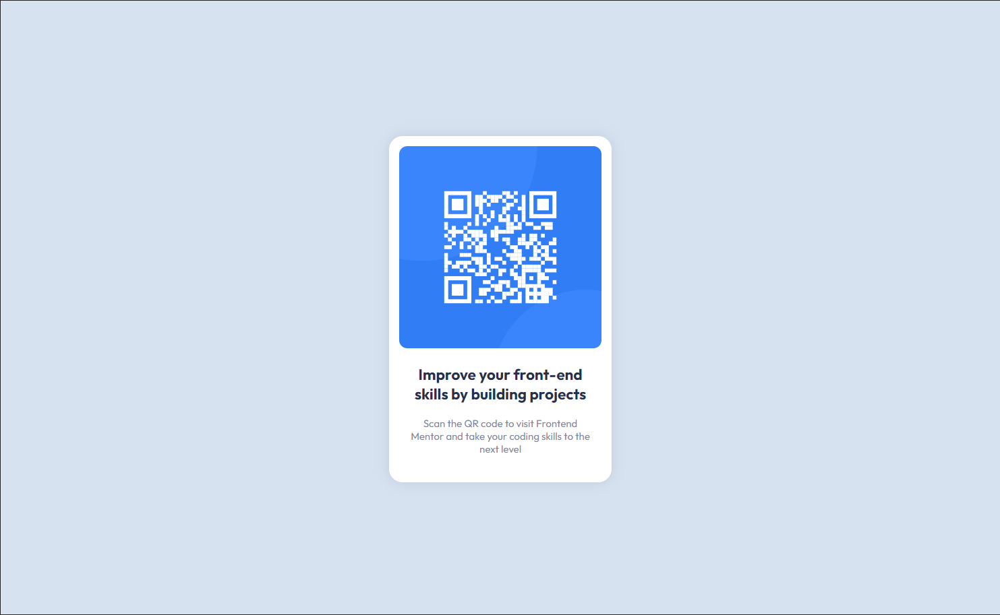

# Frontend Mentor - QR code component solution

This is a solution to the [QR code component challenge on Frontend Mentor](https://www.frontendmentor.io/challenges/qr-code-component-iux_sIO_H). Frontend Mentor challenges help you improve your coding skills by building realistic projects. 

## Table of contents

- [Overview](#overview)
  - [Screenshot](#screenshot)
  - [Links](#links)
- [My process](#my-process)
  - [Built with](#built-with)
- [Author](#author)

## Overview

### Screenshot

### Links

- Solution URL: (https://github.com/3DVince/qr-code-component)
- Live Site URL: (https://3dvince.github.io/qr-code-component/)

## My process
- Started by creating HTML5 blueprint
- Copied styling as outlined in the style-guide.md
- Fine-tuned options to make it closer to the reference image

### Built with

- Semantic HTML5 markup
- CSS custom properties

## Author

- Website - [Vincent Gruse](https://www.linkedin.com/in/vincentgruse/)
- Frontend Mentor - [@3DVince](https://www.frontendmentor.io/profile/yourusername)
